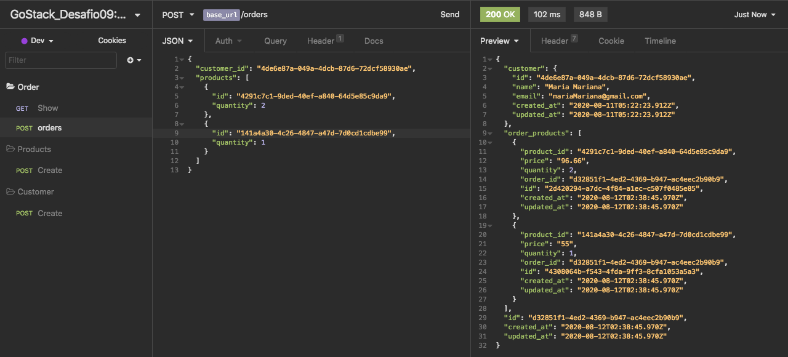
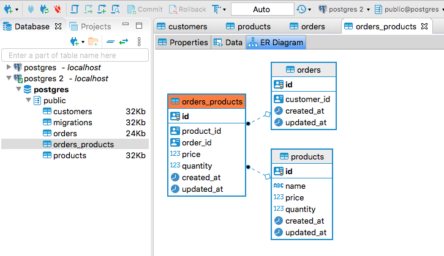

# GoStack-Desafio-09-Relacionamentos-com-banco-de-dados-no-Node.js

Nesse desafio, criei uma nova aplicação para aprender novas coisas e treinar o que aprendi até agora no Node.js
junto ao TypeScript, incluindo o uso de banco de dados com o TypeORM, e relacionamentos OneToMany, ManyToMany, dentre outros! 

 
